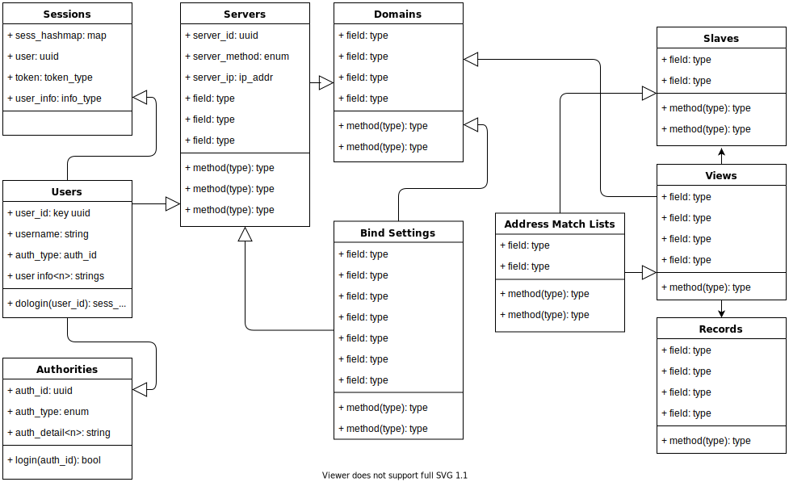

# rusty-binder

=====================

Rust based web GUI application for ISC Bind 9.16 and above.
Uses catalog zones and supports "split horizon" dns the way I need to use it.

Data model planning:

To use:

    Install this somehow...

Comments, additions, corrections and suggestions are welcome.

I will be extending the functionality as time permits.

See LICENSE for more details.
